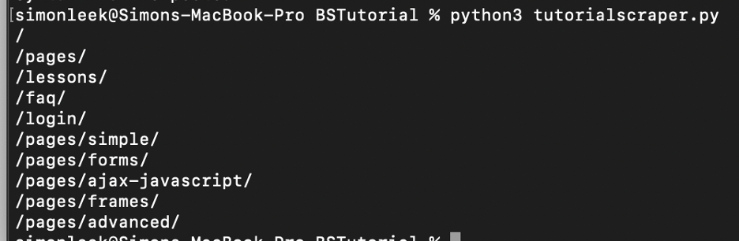
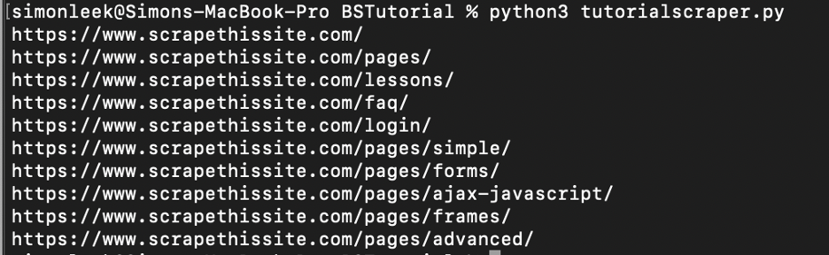
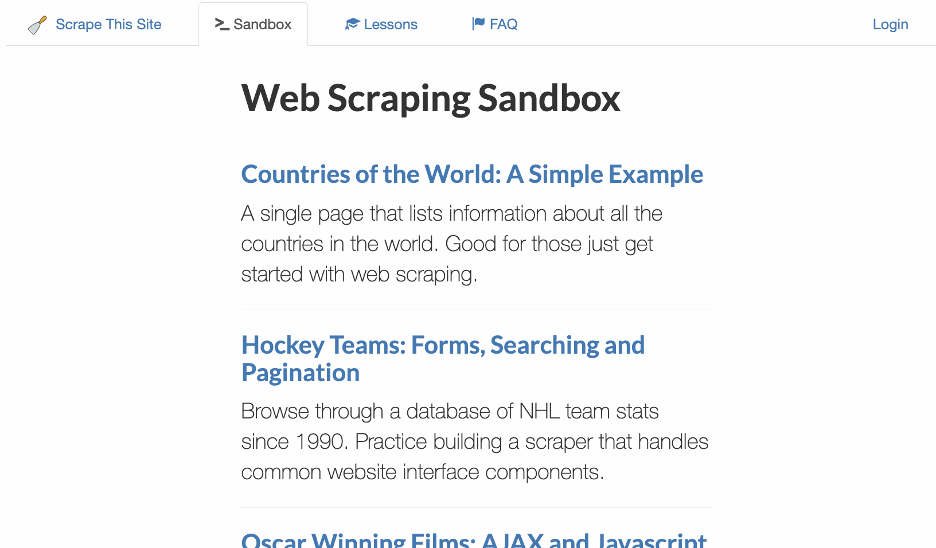
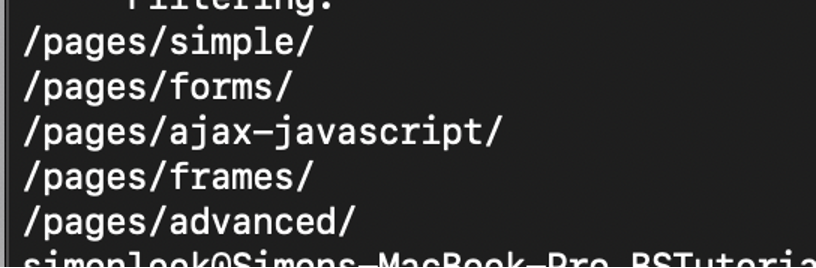
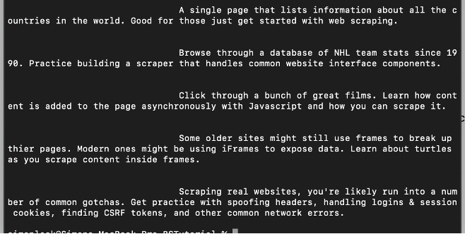
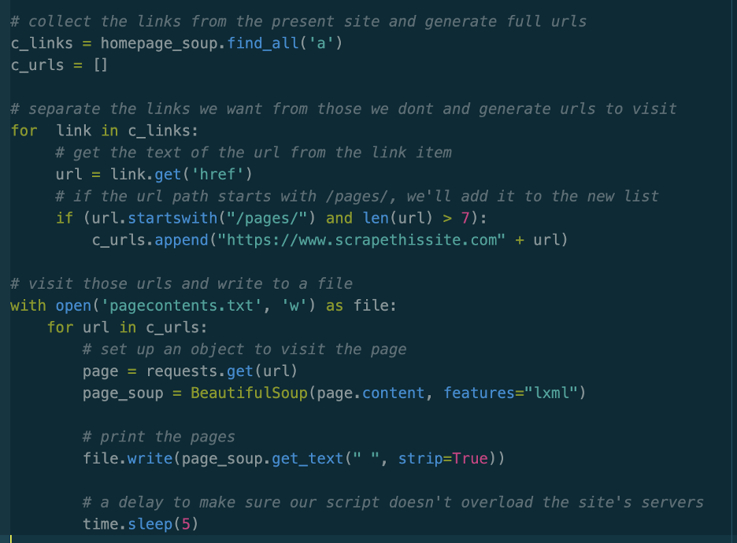
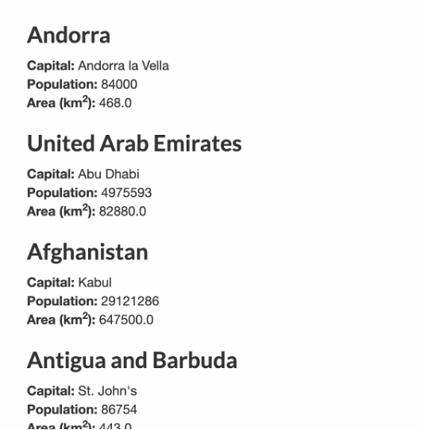
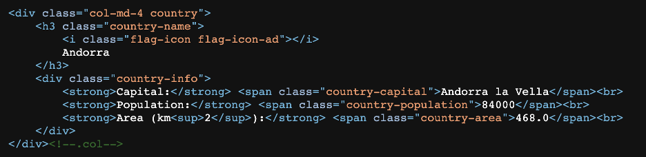
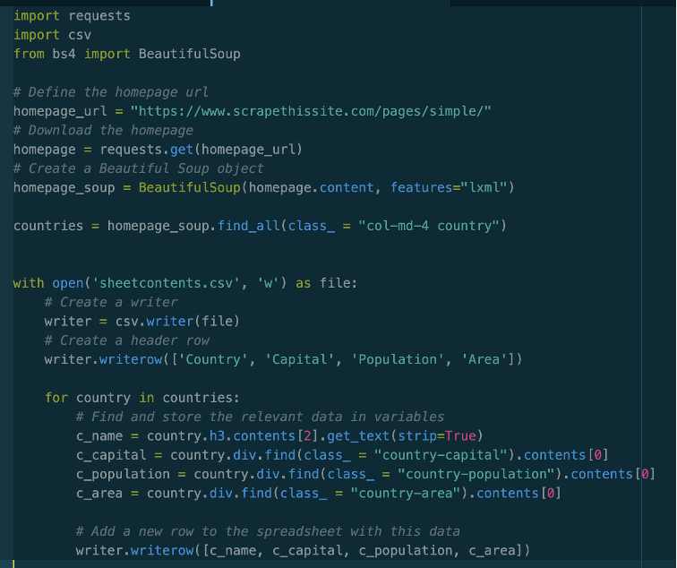
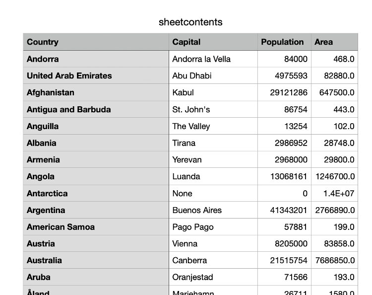

# Beautiful Soup Workflow

This workflow will help you use beautiful soup in Python to put together useful data sets. Beautiful Soup is very open ended and much less user friendly than other tools in this toolkit; Beautiful Soup makes programmatic web scraping easier whereas many other tools will do it for you. Unless you are quite comfortable with Python you should check for a more specific tool before you start using Beautiful Soup. This workflow will cover some of the basics of Beautiful Soup by working through the example of scraping data from https://www.scrapethissite.com/pages/simple/

This workflow will not be comprehensive by any means, but the goal is to cover enough to get you through a simple data collection project or to get you started with a larger project. It will assume some very basic Python programing knowledge such as how for loops and if statements work. To an extent, code in this workflow will sacrifice programming style to be as readable as possible for people with minimal Python experience. Rather than tackling one large complex task, it will go through a few simple but useful ways to use Beautiful Soup to scrape information from webpages. The full documented code is available at the bottom of this page should you want to see everything together.

## Set up:
You will have to have installed python to follow this tutorial. You can download python [here.](https://www.python.org/downloads/) 
Open a new document in a text editor of your choice. You should save the file as a Python document by using the extension ".py". I will refer to my document as "scraping.py."
Open a new terminal and navigate to the directory where you saved your Python document using the command `ls` to list directories and the command `cd` to change directories. (On Mac, you can simply navigate to the folder in which your scraping.py document exists and right click on the folder. From the dropdown, select “New Terminal at Folder.) You’ll know you have the correct folder when the name of the folder appears in the Terminal window before the prompt.
Install the dependencies for Beautiful Soup. First make sure that you have Python 3 on your machine. In terminal type the commands:

```
python3 -m pip install requests
python3 -m pip install bs4
python3 -m pip install lxml
```

If you get a permission denied error preface each command with the word `sudo`. This will prompt you to enter your password to install dependencies.

Now open the text file you created. Add the following to the beginning of your document:

```
import requests
import time
from bs4 import BeautifulSoup
```

Throughout your project you will want to run your code to debug it, test it, and finally use it to gather your data set. To run your code type this command into terminal:

```
python3 scraping.py
```

This will run the file named "scraping.py". Any printed output will appear in the terminal.

# Using Beautiful Soup.

## Case 1: Scraping Links

Often you will want to gather all the links on a specific page in order to later do something with them. (If you wanted to scrape the contents of a list of links, for instance, you might start at the homepage, collect every link there, and then visit each linked page and scrape them to collect the text there.) Let’s use Beautiful Soup to collect all the links on this page: https://www.scrapethissite.com/pages/.
Your code will be accessing the HTML of the page, which looks like this:


In HTML, the links that we are looking for appear in a specific form:
`<a href = ”some_link” > Display Name for Link </a>`
Notice also in the code above that the link is relative, meaning it needs to be attached to the base site’s url in order to become the full url. “https://www.scrapethissite.com” + “/pages/simple” = “https://www.scrapethissite.com/pages/simple”.
Now that we understand what to look for, we can begin writing code.
First, you’ll need to do some set up. The first step to any application of beautiful soup is to create a beautiful soup object.
```
# Define the homepage url
homepage_url = "https://www.scrapethissite.com/pages/"
# Download the homepage
homepage = requests.get(homepage_url)
# Create a Beautiful Soup object
homepage_soup = BeautifulSoup(homepage.content, features="lxml")
```

We can test that everything is working so far by adding an instruction to print out the HTML of the webpage.

```
print(homepage_soup.prettify())
```

Save and run your program by going to the terminal again, typing in the filename, and pressing enter. This should print out the HTML code of the webpage into the terminal. Now go back to our program, delete that last print command, and let’s continue writing.

To collect the information within those `<a></a>` tags we saw above, we can add the following code:

```
# Create a list of urls linked to from the homepage
links = homepage_soup.find_all('a')
```

The variable “links” is now storing all the links found in the page’s HTML. To see what it found, add the following code to go through each link and print it out:

```
for link in links:
    # print each url retrieved
    print(link.get('href'))
```

Now (save and) run the program again. You should see a printout like this in the terminal:


To turn these relative paths into full urls, we could make a small change to the way the printing loop works, replacing the for loop above with this one that adds the base url at the beginning:

```
for  link in links:
    # print each path retrieved as a full url
    print("https://www.scrapethissite.com" + link.get('href'))
```

Now the program gives the output we set out to create:



## Case 2: Filter Which Links are Collected.

Imagine we only wanted to get the urls of the items in the actual list on the page, those that appear under “Web Scraping Sandbox,” and to discard all the extra links not in the main part of the page (like FAQ, login, etc).



If we look at the different kind of links we collected (or hover over these items on the real page) we see that all of these items’ urls start with "/pages/". To filter, we can just use the python function `startswith()` to see if each url starts with “/pages/” or not. We’ll also impose another condition: that the url goes on past that "/pages/", otherwise we would only be getting back the url of the current page. If it does, we’ll add it to a running list. Once we’ve gone through every item in links we’ll have populated the new list `pages_links` with only these items. The code looks like this:

```
# we'll store the desired pages in here as we find them
pages_links = []

for  link in links:
    # get the text of the url from the link item
    url = link.get('href')
    # if the url path starts with /pages/ (and something else comes after it), we'll add it to the new list
    if (url.startswith("/pages/") and len(url) > 7):
        pages_links.append(link)
        print(link.get('href'))
```

(If you wanted to then turn these filtered links into full links, you could employ the method from earlier.) Run the code now and you should see the output we were looking for:




## Case 3: Scrape Text

Scraping for text within a simple webpage is fairly simple. The simplest way is to just take all the human-readable text (everything that displays when you visit the site) with the command get_text(). To see the sort of result this gives, try adding one of the following lines of code to your program and running it:

```
print(homepage_soup.get_text())
print(homepage_soup.get_text(strip=True))
print(homepage_soup.get_text(“|”, strip=True))
```

The differences between these three lines are only formatting. The first leaves paragraph breaks and non-essential formatting in the text while the second strips it out. The third inserts a vertical bar to mark where section breaks once were.

If instead you wanted to take only certain items (for example, those that appear within the `<p>` tags where most plain text exists on websites), you would do something like this:

```
texts = homepage_soup.find_all('p')

for text in texts:
    # print each paragraphs corresponding text
    print(text.string)
```

Which prints out the description paragraph under each link.



## Case 4: Combining techniques and writing to a .txt file

Let’s take on a more complex task. Imagine we wanted to start on the page we’ve been using and then scrape the text from the pages linked there (the ones under the “Web Scraping Sandbox” heading). We can combine what we’ve learned so far to achieve this. In addition, we can learn something new: how to write to a file.

Writing to a file in python is not as hard as it sounds. First, create the file you want to populate. For this example, make a blank text file called "pagecontents.txt". Our code will look like this:



The only new ideas here involve the file writing, which is done in two unfamiliar lines:
  ```
  with open('pagecontents.txt', 'w') as file:
	...
	file.write(page_soup.get_text(" ", strip=True))
  ```

The first part tells the program which file to write into and the second writes into it. The rest of the code is just ideas from earlier on in the tutorial recycled. Notice that each time we want to scrape a new page (which happens each time the for loop runs) a new Beautiful Soup object has to be created, since the object is tied to a single page.

## Case 5: Worked Example and Spreadsheets

Located at (https://www.scrapethissite.com/pages/simple/) is a site with information structured like this:


For this final task, we are going to try and scrape the data in a more structured way (rather than as a mess of text). Instead of writing to a .txt file, we’ll write to a .csv so that we can look at the data as a spreadsheet.
The data for each entry is stores in HTML that looks like this:


In order to access the information we want, then, we have to pay attention to the tags and class names. These let us pull information from the code. First, we create a list of countries by taking all the blocks that look like the one above.
```
	countries = homepage_soup.find_all(class_ = "col-md-4 country")
```

Now, inside a for loop (just like before with the links), we pull the name, capital, population, and area out. The code for this *looks* more complicated because it has been tuned to work for the way this specific site has its data structured.

```
c_name = country.h3.contents[2].get_text(strip=True)
c_capital = country.div.find(class_ = "country-capital").contents[0]
c_population = country.div.find(class_ = "country-population").contents[0]
c_area = country.div.find(class_ = "country-area").contents[0]
```

Each of these lines is just specifying for the program how to navigate the HTML code. In the first one, for example, we specify the `h3` tag to get to the area where the country name (e.g. Andorra) is stored. Then, `.contents[2]` gives us the second line (the one we care about) within the `h3` block. Finally, `.get_text(strip=True)` trims the whitespace, as we’ve already seen. The other lines employ similar methods to extract the capital, population, and area. If you are trying to work out how to do something similar on a different website with data in a different structure (and if you are feeling brave) check out the Beautiful Soup Quick Start guide [here.](https://www.crummy.com/software/BeautifulSoup/bs4/doc/#quick-start)
Finally, a little extra code lets us write these values into a .csv. (Be sure to add `import csv` to the top of your program!) A look at the final code (also available as text below): 



And the resulting spreadsheet:



# Full Code and Conclusion:

Here are two programs, the first covering all the code from Cases 1-4 above and the second dealing purely with the final case of writing to a .csv. The comments and printouts should help to guide you through the code. Since webpages can have all sorts of different structures, the best way to go about formulating your own web scraping code would be to look carefully at the source code of the page you want to scrape to determine where the information you want is stored there. Consult the BeautifulSoup [Quick Start and Docs](https://www.crummy.com/software/BeautifulSoup/bs4/doc/#quick-start) and be sure to check yoururl.com/robots.txt so that your code abides by any mandatory delays.


## Code from Cases 1-4:
```
import requests
import time
from bs4 import BeautifulSoup

# Define the homepage url
homepage_url = "https://www.scrapethissite.com/pages/"
# Download the homepage
homepage = requests.get(homepage_url)
# Create a Beautiful Soup object
homepage_soup = BeautifulSoup(homepage.content, features="lxml")

# -----------------Listing Links:-----------------

# Create a list of urls linked to from the homepage
links = homepage_soup.find_all('a')

print("-----Building full urls:-----")

for  link in links:
     # print each path retrieved as a full url
     print("https://www.scrapethissite.com" + link.get('href'))

# -----------------Filtering Links:-----------------

print("-----Filtering:-----")

# we'll store the desired pages in here as we find them
pages_links = []

for  link in links:
    # get the text of the url from the link item
    url = link.get('href')
    # if the url path starts with /pages/, we'll add it to the new list
    if (url.startswith("/pages/") and len(url) > 7):
        pages_links.append(link)
        print(link.get('href'))

# -----------------Scraping Text:-----------------

print("-----Text Scraping-----")

# print entire webpage's readable text (comment in if you'd like to see it)
# print(homepage_soup.get_text("|", strip=True))

texts = homepage_soup.find_all('p')

for text in texts:
    # print each paragraphs corresponding text
    print(text.string)

# ----------------Combining Techniques: Scraping sites at links----------------

print("-----Combining Techniques-----")

# collect the links from the present site and generate full urls
c_links = homepage_soup.find_all('a')
c_urls = []

# separate the links we want from those we dont and generate urls to visit
for  link in c_links:
     # get the text of the url from the link item
     url = link.get('href')
     # if the url path starts with /pages/, we'll add it to the new list
     if (url.startswith("/pages/") and len(url) > 7):
         c_urls.append("https://www.scrapethissite.com" + url)

# visit those urls and write to a file
with open('pagecontents.txt', 'w') as file:
    for url in c_urls:
        # set up an object to visit the page
        page = requests.get(url)
        page_soup = BeautifulSoup(page.content, features="lxml")

        # print the pages
        file.write(page_soup.get_text(" ", strip=True))

        # a delay to make sure our script doesn't overload the site's servers
        time.sleep(5)

print("Successfully written to file!")
```

## Code from Case 5:

```
import requests
import csv
from bs4 import BeautifulSoup

# Define the homepage url
homepage_url = "https://www.scrapethissite.com/pages/simple/"
# Download the homepage
homepage = requests.get(homepage_url)
# Create a Beautiful Soup object
homepage_soup = BeautifulSoup(homepage.content, features="lxml")

# make a list of each HTML code blocks entry about each country
countries = homepage_soup.find_all(class_ = "col-md-4 country")

# open the .csv file and do some setup to allow us to write to it
with open('sheetcontents.csv', 'w') as file:
    # Create a writer
    writer = csv.writer(file)
    # Create a header row
    writer.writerow(['Country', 'Capital', 'Population', 'Area'])

    # for loop that runs once for each country
    for country in countries:
        # Find and store the relevant data in variables
        c_name = country.h3.contents[2].get_text(strip=True)
        c_capital = country.div.find(class_ = "country-capital").contents[0]
        c_population = country.div.find(class_ = "country-population").contents[0]
        c_area = country.div.find(class_ = "country-area").contents[0]

        # Add a new row to the spreadsheet with this data
        writer.writerow([c_name, c_capital, c_population, c_area])
```
