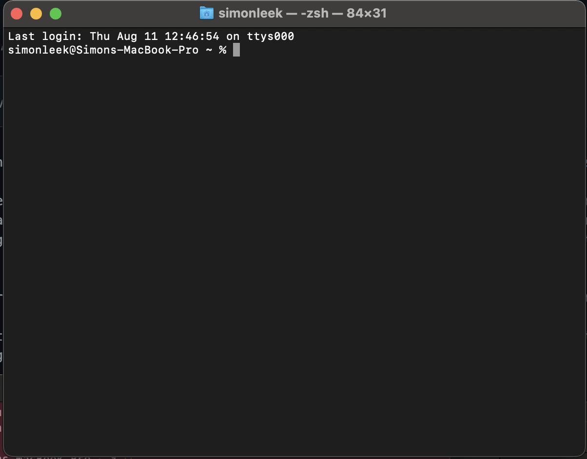
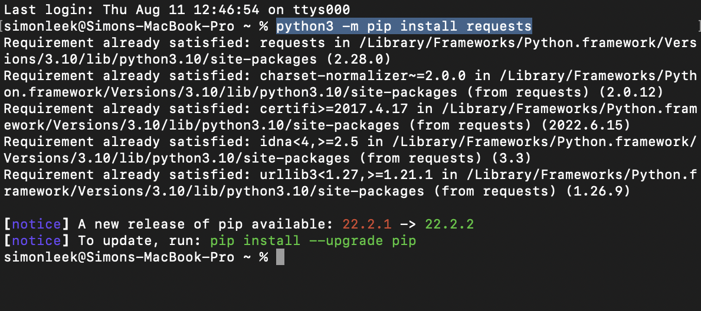
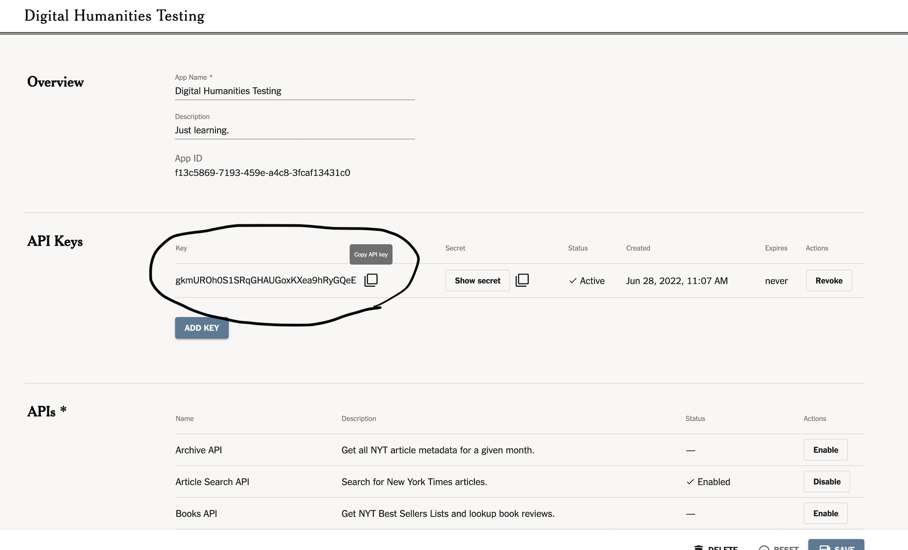
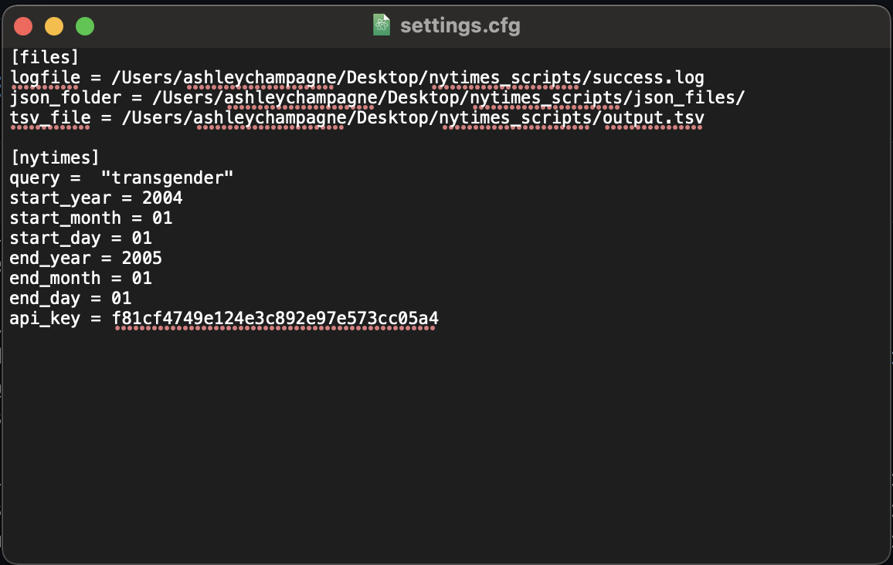
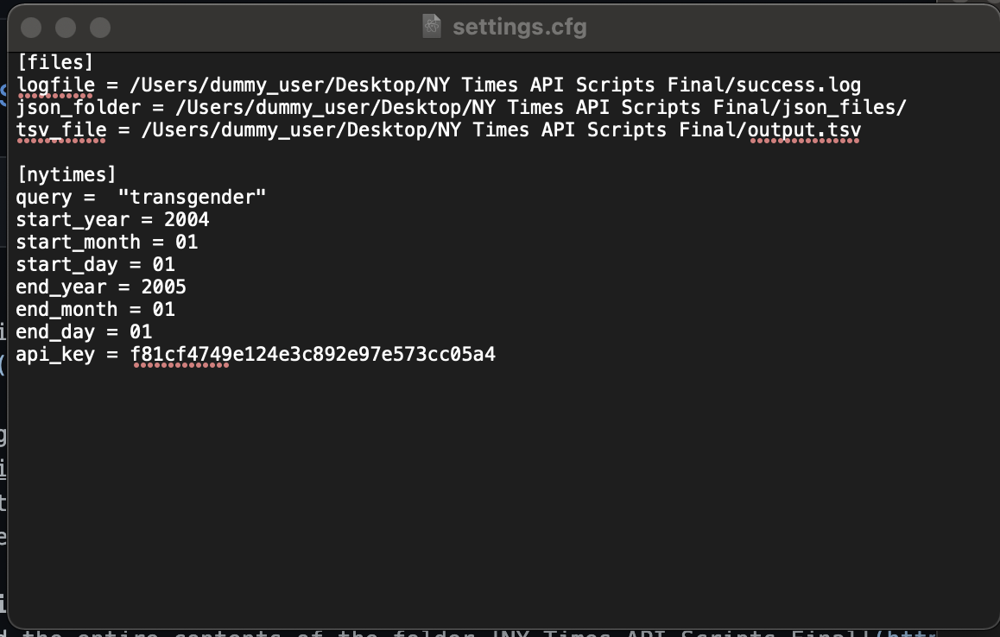
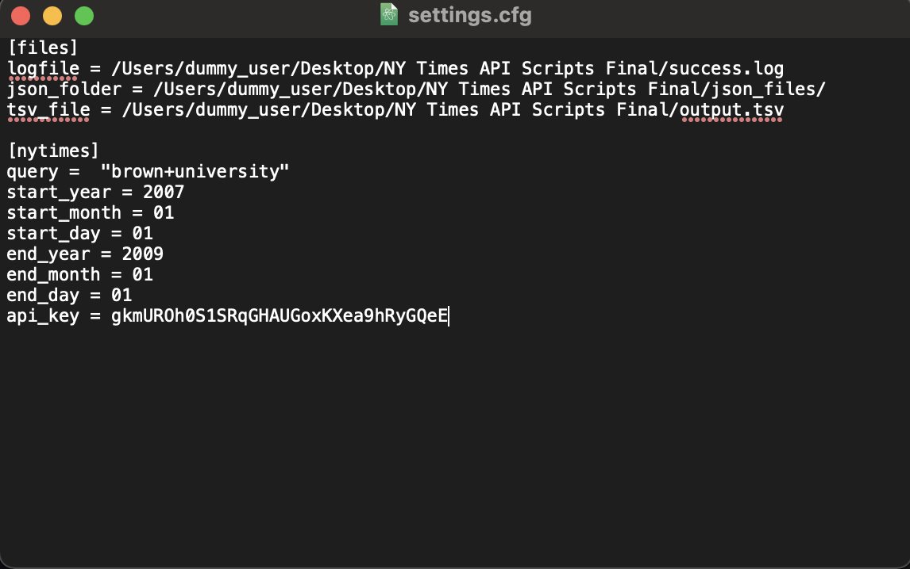
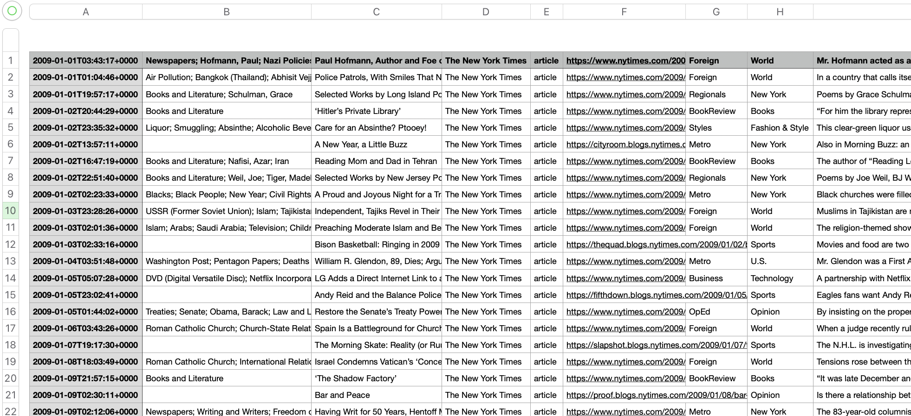
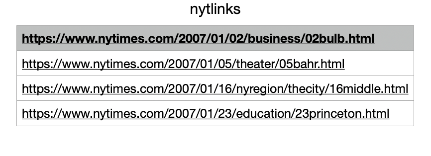
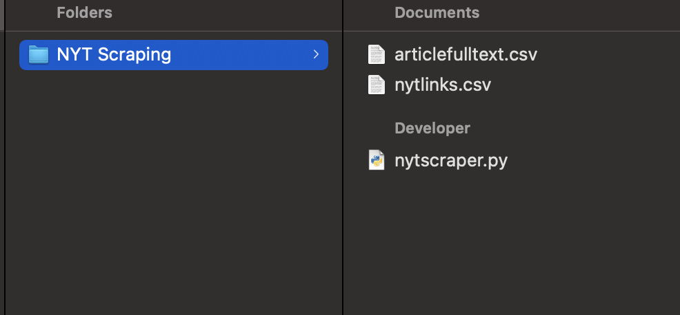
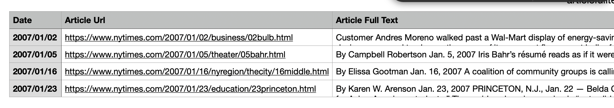

# Scraping NYT Using Beautiful Soup

## Requirements

This workflow requires you to run pre-written python programs in order to search and then collect article data from the NYT archives. In order to run these programs, you will need: 

### Python and Python Packages
* To install python if you have not already. Download a recent version from [this link](https://www.python.org/downloads/). This tutorial was written as of version 3.10.5. 
* To install a few python modules to help these programs run. Rather than downloading anything from a website, this requires you to go into the Terminal (if you are on Mac) or Command Prompt (on Windows) and enter some commands. First, search for the relevant program on your device (Terminal or Command Prompt, depending on which type of computer you have) and open it. You will see a screen that looks like this: 
* Since you have already installed python in the first step above, you can begin installing the relevant packages. Type (or copy) in the command `python3 -m pip install requests` and press enter. It may take a moment to complete (you will see text appearing and scrolling by, listing the progress of the download), but eventually the command line will reappear with the flashing cursor, like so:  You will have different text between the first command (highlighted in blue in the image) and the new command line (at the bottom, where the grey box cursor now is), because you are downloading these packages for the first time. 
* In the same way you entered this command and then waited for it to finish, enter the following commands:  
* `python3 -m pip install bs4`
* `python3 -m pip install lxml`
* Now you have everything set up to run these scripts! 

### NYT API Key 
* You will also need an API key from the NYT. Follow the sign up process [here](https://developer.nytimes.com/) to create a developer account. Once you are signed in, go to the "My Apps" page [here.](https://developer.nytimes.com/my-apps) 
* Click the "+ New App" button in the top right corner. Give your project a name and make sure to Enable the Article Search API. Click save, and you should be brought to a screen that looks like this: 

* Copy the API Key circled in the image above by clicking the little button with two squares to the right of it. Put this in a note document where it will be convenient to access. 

## Setting up for Searching 
Download the entire contents of the folder [NY Times API Scripts Final](https://drive.google.com/drive/folders/1vjO6bP7XOx_lNxN7-rzF1OqjY-L-RhlY). 

Put this folder on your Desktop. Within, add another empty folder named "json_files".

Now, click on the folder "Config" inside of the "NY Times API Scripts Final" folder that you've just downloaded and moved to your desktop. Inside is a file named "settings.cfg". Right click and open with a text editor, for example TextEdit on Mac or Notepad on Windows. (If the text editor is not showing up when you right click, you can drag the file onto the application's icon in the bottom bar.) You will see a file that looks like this: 


You'll need to make some set up edits before refining your search:
* Replace the string of text next to `api_key = ` with your own API key from earlier. 
* Go to the "NY Times API Scripts Final" and copy the path name. To do this on Mac, press Command + Option + C. On Windows, press Alt + D and then Ctrl + C. 
* Paste this in between the first and last "/" in each of the file paths in the config file, ie replacing the text `/Users/ashleychampagne/Desktop/nytimes_scripts/`. When you are done with this step, the file should look like this, but with your own file path instead of the placeholder there. 


Now you can refine your search terms. The names of each variable explain what they control in the search. An example new search ready to be deployed might look like this: 


Decide what you want to search for and input the relevant terms and dates.  

## Running the Searcher

Now that everything is set up, it's time to run our search. To do so, go back to the terminal. Enter the command `cd Desktop` and then `cd "NY Times API Scripts Final"`. Now that you have navigated to the folder where script is, you can type the command `python getTimesArticles_fq.py` and press enter. This will run the script that performs the search that you set up by changing the values in the config file. It will take a few minutes to run--longer, if your search term and date range is going to return a lot of results. You can always force quit the script by either quitting out of the Terminal or Command Prompt window or by pretting Ctrl+C. 

When the script is done running, you should see some new files created in the folder "NY Times API Scripts Final": `success.log`, `output.tsv`, and the folder "json_files" will have some new files in it. For this tutorial, we are only going to use the `output.tsv` file, which you can double click on to open in a spreadsheet viewing app. It will look something like this: 

## Setting up for Scraping 
After you have created a spreadsheet with the results of your NYT search, you may want to find the full text of these articles. 

To do this, first select the column that contains the article urls. Copy the column and paste it into a new, empty spreadsheet. The new file will have just the one column containing the urls you want to visit. It should look like this:



Using either Export or Save As, save this file as a `.csv` file with the name `nytlinks.csv`. Put it in a new, empty folder called "NYT Scraping", which can live on your Desktop.

Download the following file titled `nytscraper.py` into that folder as well: [nytscraper.py.](Code/nytscraper.py)

To complete the setup, open a text editor (TextEdit will work fine) and save an new, empty file with the name `articlefulltext.csv`. (Once this file is populated with information, you can rename it and move it elsewhere. For now though it has to have this specific name so that the program can find it.) Make sure it is also saved to the "NYT Scraping" folder. At this point, the folder should look like this: 



## Running the Scraper 

Navigate in the terminal to the "NYT Scraping" folder, either by right clicking and selecting "New Terminal at Folder" or by using `cd` commands to navigate to it. (For example, if it was in your documents folder, you would start with the command `cd Documents` and then type `cd "NYT Scraping"`).

Now type or paste into the Terminal or Command Prompt this command to run the program:

```
python3 nytscraper.py
```

and press enter. It may take a moment for the program to run. You'll know it's done when the terminal prints "Done Scraping!"

Now open the file `articlefulltext.csv`. You should see it populated with three columns: date, url, and full text, like this:



You can now save this file with a new name and proceed as you want with it! 

### Next Steps

To explore possible uses of the new article text data you've extracted, check out the libary's resources on [text mining.](https://libguides.brown.edu/text-mining)
