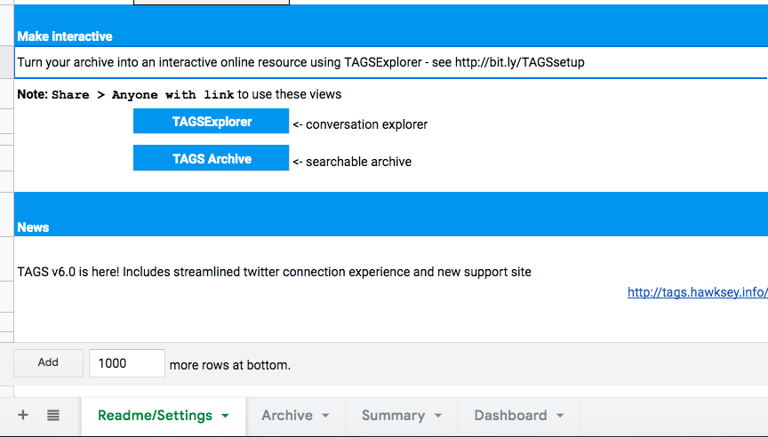

# Scrape Twitter with TAGS 

The ability to collect, archive and analyze social media posts is a useful skill. It can be important to study what people are writing on twitter on a larger scale than manually searching hashtags or usernames. One way to scrape content is by using the Twitter Archiving Google Spreadsheet developed by Martin Hawksey that allows you to collect tweets, up to seven days in the past and tweets written in the future. Specifically, the tool allows you to:

1. Collect tweets from specific users
Gather tweets under a certain hashtag (e.g. #econbiz)

1. Analyze the data you need to study the tweets and see trends. 

## What you’ll need to get started:

1. A Twitter account
1. A Gmail account

## Step by step instructions:

1. To download TAGS v6.1 and “Copy the Spreadsheet” when you see the prompt.
1. Now, rename your spreadsheet from “Copy of TAGS v6.1.9.1” to whatever you’d like to call it.

1. Set up Twitter access - choose “easy” setup. (This is where you need your twitter account, and you’ll need to sign in and allow access).
1. Finally, return to the “TAGS” tab and click “Add Summary Sheet” and “Add Dashboard Sheet” right away so that the tabs on the bottom of your spreadsheet look like this: 

1. Fill out the Advanced Search
If you made it through installation -- congrats! You’re ready to start your search. TAGS can collect tweets by hashtags, user names, mentions, and more (e.g. #econbiz).
* Try searching for a hashtag in the “Enter Term” box

* Once you type in a hashtag, click the “TAGS” tab and then click “Run now!” 

* If the script runs correctly, click the “Archive” tab on your spreadsheet. Do you see all the tweets you collected? 

## Study the Tweets

### In the “Dashboard” tab, you should see some trends. 

From this tab, you can now see the top tweeters who have been using the hashtag you searched for. 

### In the “Summary” sheet, you can see more detailed information on tweets within your search.

You can also view your data in two additional ways: 
* with the TAGS Archive (a searchable archive of tweets) 
* the TAGS Explorer (a network visualization). 

To do so, first “share” your spreadsheet. 

Then, publish your spreadsheet to the web under the “File” tab 

Return to the “Summary” tab in your TAGS sheet. You can now click “TAGS Explorer” and see an interactive network analysis visualization of the users who are tweeting about your selected hashtag. 

Now Click “TAGS Archive” in the “Summary” tab. You’ll now see a searchable archive of tweets, and user images. 

