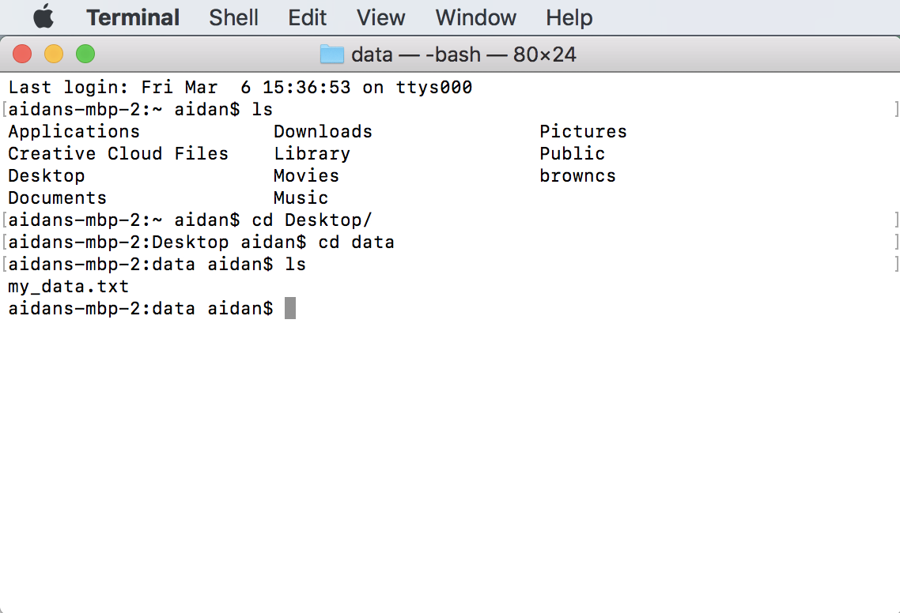

# Spreadsheet to Text File Workflow
_This workflow will allow you to split the contents of a spreadsheet into several text files, creating one text file for each row of the spreadsheet. Last updated March 2020._
***
### Requirements:
* Microsoft Excel (_Instructions on Downloading Excel for free can be found [here](https://ithelp.brown.edu/kb/articles/install-microsoft-office-office-365-students-faculty-and-staff-personal-computers) for Brown University Students, Faculty, and Staff_)
* A computer running macOS, Microsoft Windows, or Linux
### Step 1: Open your spreadsheet in Excel
* If your spreadsheet is in Google Sheets navigate to _file&rarr;download&rarr;Microsoft Excel (.xlsx)_
* Open Excel and open your .xlsx file from Excel
### Step 2: Export Spreadsheet to a Text File from Excel
* Create an empty folder that you will fill up with your text files
* From the Excel toolbar navigate to _file&rarr;save as_
* Name your .txt file. For example, "my_data.txt"
* Set _where_ to the folder you just created
* Set _file format_ to "Tab Delimited Text (.txt)"
* Press Save
### Step 3: Chop each line of your new .txt file into its own.txt file
##### Step 3 on macOS:
* Open terminal 
    * Press &#8984;space
    * type "terminal"
    * press enter
* Navigate to the folder containing your .txt file
    * Type "ls" and press enter to see what folders are avalible to move to
    * Type "cd" and the name of a folder to move into. For example "cd Desktop"
    * For example, if my folder is called "data" and is saved on my desktop, I can navigate to it from a new terminal with the commands:
    ~~~
    cd Desktop
    cd data
    ~~~
    or the command 
    ~~~
    cd Desktop/data
    ~~~
* Alternately, you can open a Terminal directly at the folder by right clicking on the folder and selecting "New Terminal at Folder" from the drop-down menu. 
* If you type "ls" and press enter you should see the name of your .txt document
    
* Type or copy into terminal the command:
    ~~~
    split -a4 -l1 my_data.txt row
    ~~~
* You're done! Navigate to your folder and confirm that a .txt file has been created for each row of your spreadsheets. The filed for rows 1, 2, ..., 456976 will be named rowaaaa.txt, rowaaab.txt, ..., rowzzzz.txt respectively. 
* Note also that "row" is just a name to use for naming the files created. If you wanted to name your files something else, you could. For instance: 
    ~~~
    split -a4 -l1 my_data.txt museumentry
    ~~~
    Would create files labelled with "museumentry" rather than "row." 
    
##### Step 3 on Microsoft Windows:
* [Install Git for Windows](https://git-scm.com/download) if you have not already
* Open Windows command line (DOS)
    * Click Start
    * In the _Search_ or _Run_ line type "cmd"
    * press enter
* Navigate to the folder containing your .txt file
    * Type "dir" and press enter to see what folders are avalible to move to
    * Type "cd" and the name of a folder to move into. For example "cd Desktop"
    * For example, if my folder is called "data" and is saved on my desktop, I can navigate to it from a new terminal with the commands:
    ~~~
    cd Desktop
    cd data
    ~~~
    or the command 
    ~~~
    cd Desktop/data
    ~~~
* If you type "dir" and press enter you should see the name of your .txt document
    
* Type or copy into terminal the command:
    ~~~
    split my_data.txt -l 1 
    ~~~
* You're done! Navigate to your folder and confirm that a .txt file has been created for each row of your spreadsheets. The filed for rows 1, 2, ..., 456976 will be named rowaaaa.txt, rowaaab.txt, ..., rowzzzz.txt respectively. 

##### Step 3 on Linux:

* Open a new terminal 
* Navigate to the folder containing your .txt file
    * Type "ls" and press enter to see what folders are avalible to move to
    * Type "cd" and the name of a folder to move into. For example "cd project"
    * For example, if my folder is called "data" I can navigate to it with the command:
    ~~~
    cd data
    ~~~
* If you type "ls" and press enter you should see the name of your .txt document
    
* Type or copy into terminal the command:
    ~~~
    split -a4 -l1 my_data.txt row
    ~~~
* You're done! Navigate to your folder and confirm that a .txt file has been created for each row of your spreadsheets. The filed for rows 1, 2, ..., 456976 will be named rowaaaa.txt, rowaaab.txt, ..., rowzzzz.txt respectively. 
