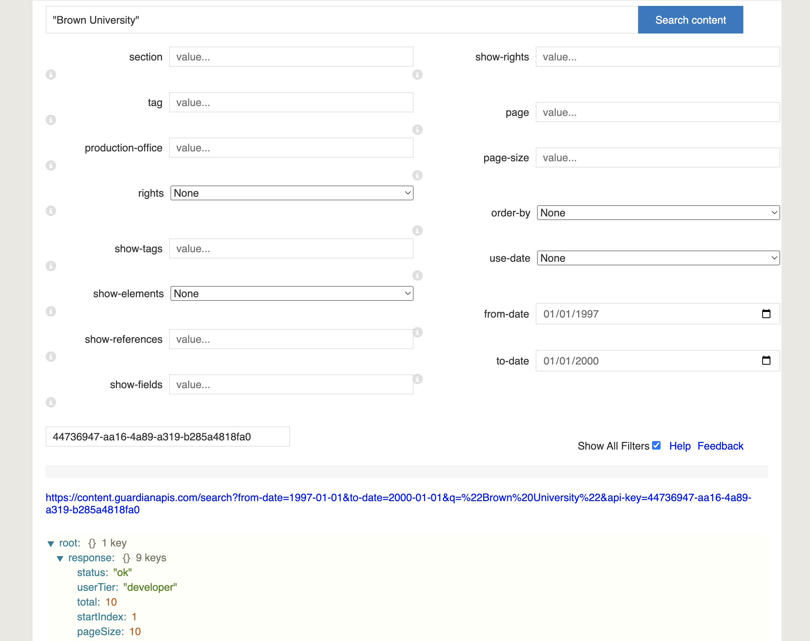
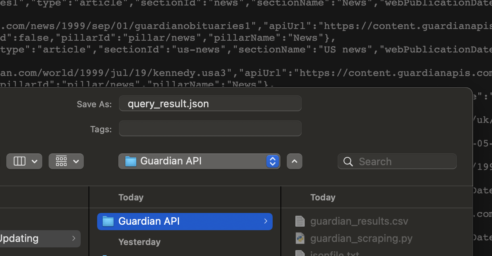
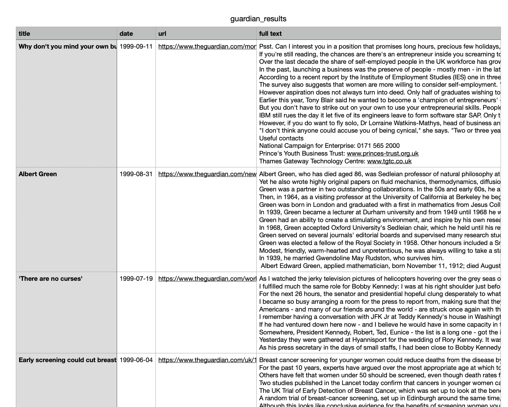

# Guardian Collection Workflow

This workflow will take you through the process of getting access to, searching, and finally collecting data from The Guardian's database. 

_Last Updated Aug 2022_ 

## Getting Access and Searching the Database

First you will have to procure a Guardian API Key: ([register on developer's site and request a key for the "articles" API.](https://open-platform.theguardian.com/access/)) 

To search The Guardian using the Guardian's API Console: 
    In a web browser, go to the URL of the Guardian's "Open Platform API Console": <http://open-platform.theguardian.com/explore/>

When the Guardian's API console search form loads, check the box in that form for "Show All Filters."  Then fill in the following fields in the form:
    * search term in double quotes (e.g. "transgender")
    * order-by (choose "oldest")
    * page-size (set at 200 to show the maximum number of hits per search-results page)
    * from-date & to-date (in the format "YYYY-MM-DD")
    * api-key (your Guardian api key)

At the bottom of the Guardian API Console web page, you'll instantly see a live view of the results returned by your search. It should look something like this: 



Click on the blue link between the search field and the search results. This will take you to a page with a big block of text. Save this page either with Right Click => Save As or just Command + S. Give the file the name `query_result.json` and save it to a folder with a name like "Guardian Search."



## Collecting Articles 

To collect the full text of the articles, you will need to download and run a python script called `guardian_scraping.py`. You can find the script to download [here.](Code/guardian_scraping.py)

Put the `guardian_scraping.py` file into the "Guardian Search" folder. Into the same folder, create an empty text file and name it `guardian_results.csv`. 

If you have not already, download a recent version of python3 from [this link](https://www.python.org/downloads/).

Now, right click on the "Guardian Search" folder and select "New Terminal at Folder." Enter the following commands one by one to install the packages the program needs to run correctly: 

```
python3 -m pip install requests
python3 -m pip install bs4
python3 -m pip install lxml
```

To run your program, enter the command:
```
python3 guardian_scraping.py
```

The program is finished when it prints into the terminal the phrase "Scraping Done!" 
From your file browser, double click to open the `guardian_results.csv` file. It should now be populated with the articles from your search results, complete with dates, titles, urls, and the article's full text! 


