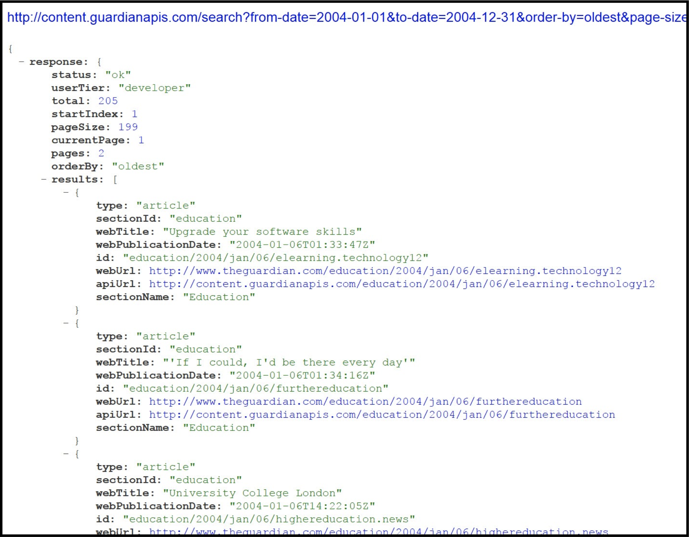
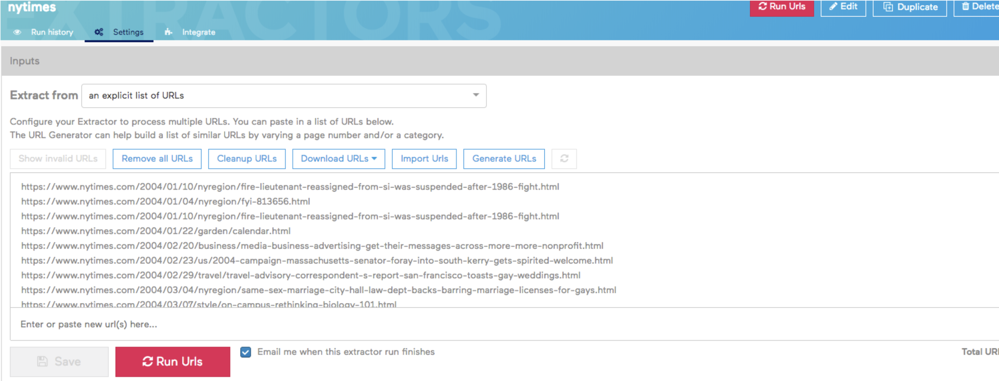
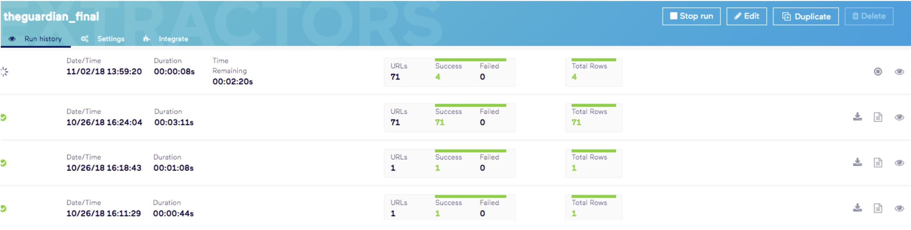
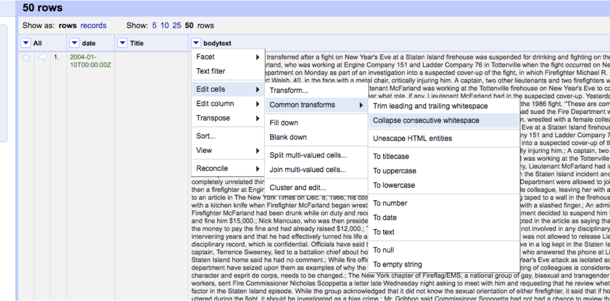
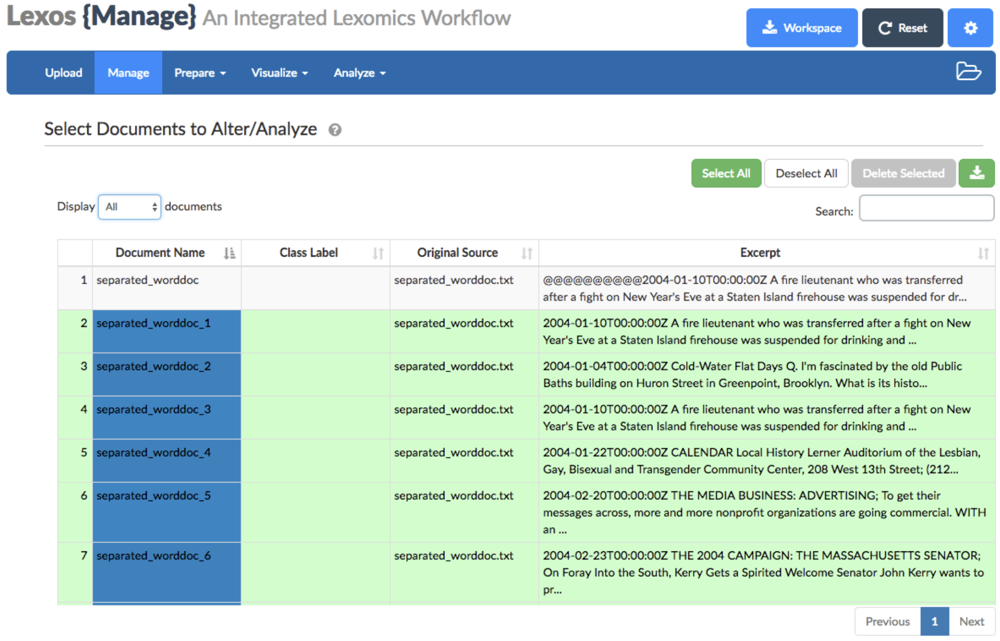

# Guardian Collection Workflow

_This page provides instructions for collecting articles from the Guardian. It was originally created for the WhatEvery1Says project, led by Dr. Alan Lui. It was last revised on February 25, 2019 by Ashley Champagne for the workshop “Thinking Critically About Data: Using APIs to Create Qualitative Data”_

***
# Using the Guardian API for searching & [Import.io](https://www.import.io/) (as scraper) 
### Requirements:
* Guardian API Key ([register on developer's site and request a key for the "articles" API](https://open-platform.theguardian.com/access/)) 
* [Import.io](https://www.import.io/) (free trial) -- Note: [Import.io](https://www.import.io/) can be used in a browser to extract data automatically from a Web page 
* [Open Refine](http://openrefine.org/) 
* [Lexos](http://lexos.wheatoncollege.edu/upload)
### Workflow Steps:
#### 1. Use the Guardian API to get data
* Get a Guardian API Key if you don't have one ([request developer key](https://open-platform.theguardian.com/access/)).
* Search The Guardian using the Guardian's API Console: 
    In a web browser, go to the URL of the Guardian's "Open Platform API Console" (beta version, not the old version): <http://open-platform.theguardian.com/explore/>
    ](http://open-platform.theguardian.com/explore/)
* When the Guardian's API console search form loxads, check the box in that form for "Show All Filters."  Then fill in the following fields in the form:
    * search term in double quotes(e.g. "transgender")
    * order-by (choose "oldest")
    * page-size (set at 200 to show the maximum number of hits per search-results page)
    * from-date & to-date (in the format, e.g., "2014-01-31")
    * api-key (your Guardian api key)
* At the bottom of the Guardian API Console web page, you'll instantly see a live view of the 

returned by your search parameters, including the URLs for the pages found.  The maximum number of hits on a single search-results page is 199. Select and copy the JSON results. Copy beginning with the first curly bracket "{"  to the last curly bracket" }"

* For multiple search-results pages:
    * The JSON search results start with metadata that includes, the number of the current search-results page and the total number of search-results pages (e.g., current Page: 2, pages: 2). This shows how many total results there are and whether you need to gather the JSON on extra search results pages.
    * If so, after harvesting the results of one search-results page (by copying the JSON into a "guardian-json" spreadsheet through the process described below), you can use the "page" field in the Guardian API Console's search form to request the next page of search results.
    * You'll then need to copy and accumulate the JSON from each set of search-results at the bottom of the JSON previously collect in the "guardian-json" spreadsheet.
* Collect the URLs of the links from the Guardian search in Excel:
    1. Paste the JSON search results from the steps above into a blank spreadsheet, e.g., and Excel sheet (using "paste special" to paste without formatting). Name the spreadsheet "guardian-json.xlxs" and save it among your working data. 
    2. Select the first column, then go to Data view ("Data" tab in Excel) and click on "Filter." 
    3. Cell A1 will now show a little drop-down arrow.  Click on the arrow, and choose: Text Filters > Begins with.  Type in "webURL: " (includes space after the colon). Then click "OK" to filter the worksheet to show only the rows beginning with this expression.
    4. Next do a search-and-replace in Excel to replace "webURL: " (includes trailing space) with nothing. This will leave you with a visible column of URLs without extraneous matter.
    5. Finally, copy the column of URLs, excluding any rows with only a curly bracket (and save the URLs in your working data as "urls.txt").
#### 2. Scrape articles using [Import.io](https://www.import.io/) (Get full text articles):
* Open a browser to <https://app.import.io/dash>. import.io has a variety of extractors that you can train. 
* Create a new extractor and paste in one URL from your collection.
* Train your extractor by clicking on “new column” and dragging the content you’d like within the green box that will appear. You can continue to grab the content as you need -- you don’t need to grab it in one swoop. 
* Click on a “new column” when you want to add text that you’d like to separate out. So, if you’d like the article body separate from the author, you’ll want to create separate columns for “article body” and for “author.” 
* Save your extracter as a name you’ll recognize in the future.
* Once you’ve saved your extractor, it should appear within the right hand side of your browser. Click the extractor and click “settings” on the page.
* Click “extract from an explicit list of URLs” and upload your CSV or Excel XLSX file of urls. 

* Click “run URLs” to have the extractor crawl through every URL in the same way you originally trained it.
* Download the data as a .xlsx file.

* Open your spreadsheet:

#### 3. Clean your data: Use OpenRefine to convert the dates to eliminate unwanted whitespace.
1. Open the OpenRefine interface:
    * On a Windows machine: Open the “C:/openrefine-win-2.6-rc2/openrefine-2.6-rc2” folder in your system and run “openrefine.exe” by clicking on the named file twice to open the OpenRefine interface at the address 127.0.0.1:3333 (you can always navigate back to the OpenRefine interface by pointing your browser to this address, and can even use it in multiple windows using it).
    * On a Mac: Open OpenRefine in Applications.
    * It will open up a tab in your web browser. 
2. Once you are in the OpenRefine interface, click “Create Project” and upload the spreadsheet you recently finished editing. Click "Next" and then Create Project" again.
3. Pubdate: We now need to change the pubdates to UTC format (e.g., 2016-01-01T00:00:00Z).
    * To change this, mouse over the arrow at the top of the pubdate column. 
    * Select Edit Cells > Common transforms > To date. This should change all of the dates in the column to UTC format
4. Make sure there is no whitespace in any of your columns:
    * Open that column's drop down menu, and select "Edit Cells" > "Common transformations" > "trim leading and trailing whitespace”. 
    * Within the “article body” column, select “Edit Cells” > “Common transformations” > “Collapse consecutive whitespace”
5. Export your cleaned data as a .xls document. 

#### 4. Separate the texts into individual plain text files for text analysis 

_An alternative and more efficient method to acomplish step four is avalible [here](https://github.com/ashleychampagne/Web-Scraping-Toolkit/blob/master/Spreadsheet-Splitting-Workflow.md). The Lexos method below is only reccomended if you are on a Windows machine that does not have Git installed. If you are on Mac, Linux, or Windows with Git installed it will be easier to use the linked workflow._

1. Open a Word document that you will name, and paste (unformated) in the contents of the columns you exported from open refine. This will create a file with all the articles (beginning with date, author, title preceding the article body or whatever column order you’re using). Individual articles are separated from each other by a return (the only use of returns in the file).  
1. Using Word's find-and-replace function, replace all returns (found by searching for "^13") with three spaces, followed by ten "@" signs, followed by two returns ("   ^13^13@@@@@@@@@@").  This creates an easy-to-recognize and -manipulate delimiter between individual articles in the aggregate file. 
1. Finally, save or export the.docx Word file as a .txt file (e.g., save as “aggregate-plain-txt”) as follows: 
When Word shows the dialogue for conversion to plain text, choose "other encoding" > "Unicode UTF8" (i.e., do not choose "Windows default").
1. There are a number of tools to chop one file into multiple files using a specific delimiter. In our case, our delimiter is the ten "@" signs (@@@@@@@@@@) between each of our articles. 
You can use [Lexos](http://lexos.wheatoncollege.edu/upload) to cut your plain text file at the delimiter (@@@@@@@@@@), and then download the cut files into individual plain text documents. The value of this is that you can now explore the corpus you’ve created down to the document level. 
1. Finally, check the folder icon at the top of the Lexos page. Do you see your files? Download your files. You should now have a folder with individual plain text files of each document. 

