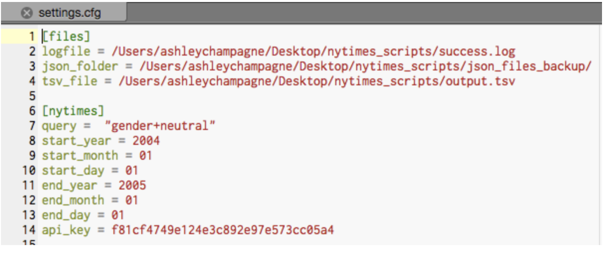
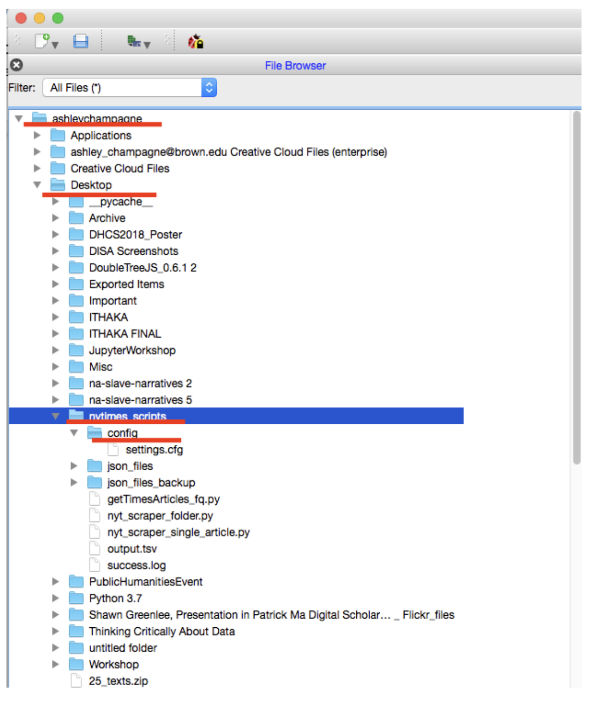
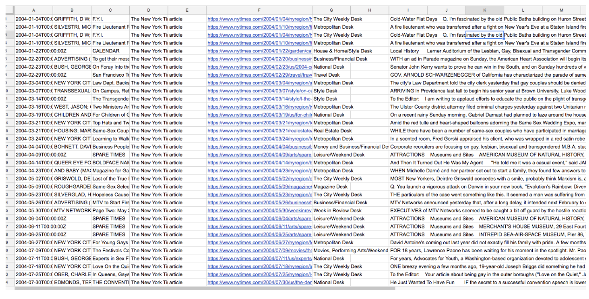
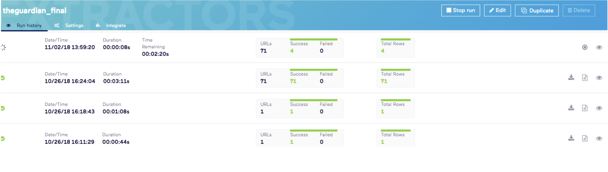

# New York Times Collection Workflow
_This page provides instructions for collecting articles from the New York Times (1981-). It was originally created for the [WhatEvery1Says](http://we1s.ucsb.edu/) project by [Dr. Alan Liu](http://liu.english.ucsb.edu/). It was last revised on October 30, 2018 by [Ashley Champagne](https://library.brown.edu/create/cds/people/ashley-champagne/) and [Birkin Diana](https://library.brown.edu/about/stafflist.php) for the workshop “[Thinking Critically About Data: Using APIs to Create Qualitative Data](https://blogs.brown.edu/libnews/misconceptions-data/#)”_

***

### New York Times (1981-present)
### Using NY Times API for searching & Import.io as scraper 
#### _(last revised October 30, 2018)_. 

See [details of access by time range](http://www.nytimes.com/ref/membercenter/nytarchive.html) to full-text, partial-text, PDF versions of the articles discoverable through the NYT API)

### Overview

* The NY Times has a complicated history of evolving source code with at least the following epochs: 1981-2004, 2005, 2006-11, 2012-present. Though all articles from the NY Times archives are now wrapped in the paper's contemporary look-and-feel, earlier source code for article bodies retain most of their original formatting/tag structure (with light changes) and are simply embedded in the more modern code. 
* This means that we have to use different strategies for each major epoch of code (e.g., different scrapers or combinations of scrapers).

### Requirments 

* NY Times API Key ([request a key](https://developer.nytimes.com/get-started))
* [Python](http://4humwhatevery1says.pbworks.com/Programming%20Resources#python) (2.x version)
* Scripts for NY Times located in the “[NY Times API Scripts Final](https://drive.google.com/drive/folders/1vjO6bP7XOx_lNxN7-rzF1OqjY-L-RhlY?usp=sharing)” folder 
* Import.io
* [Open Refine](http://openrefine.org/)
* [Outwit Hub Pro](http://4humwhatevery1says.pbworks.com/w/page/97885859/NY%20Times%20Collection%20Workflow#) (for the blog articles in later years of the NY Times - we won’t be collecting later years in our workshop, so no need to download for the workshop itself)
* [Lexos](http://lexos.wheatoncollege.edu/upload)
* [Enthought Canopy IDE](https://store.enthought.com/downloads/) [integrated development environment] for Python 
* Google Drive and Google Spreadsheet

### Workflow Steps 
1. Use the NYT API and getTimesArticles_fq.py Python script.
    - Adjust the settings.cfg file for the getTimesArticles_fq.py script to insert the paths for your working space, the search terms you want, and the date span you want. To search for a phrase, enter the phrase in the format "liberal+arts". (Note that the settings.cfg file must be located in a "config" subfolder within the folder holding the getTimesArticles_fq.py script.) Please see the below image for how your settings.cfg file should look:
    
    Tip: if you have a Mac, hold down the option, command, and c key to copy the full path and paste into the settings.cfg file
    - When you open Canopy, you should be able to see the files in your user name file path. See image below: 
    
    - Run the getTimesArticles_fq.py script.  (Double click on the file, which will pull it into a Python editor in the Enthought Canopy IDE [integrated development environment] for Python.  Then from the menu at the top of the IDE, go Run > Run file.)  This will start the script, which uses the NY Times API to search systematically for articles in a date range for a query term, pulls in the JSON output from the API for each found article, and harvests metadata from the JSON files in a cumulative TSV (tab separated values) file.  Depending on the date range specified for the search, this can take a long time.  When the script completes, you will see the command prompt again in the Python environment.
        * Error correction: Occasionally, the Python script will terminate prematurely when it encounters some kind of error during querying and getting of information through the NY Times API. In that case, locate the last JSON file retrieved (whose file name shows the date (e.g., "20011014"), reset the settings.cfg file to start at that date, and restart the Python script. (The .TSV file that the Python script writes as it harvests data from the JSON files is rewritten cumulatively after each JSON file, so after a fresh start the Python script simply keeps adding to the bottom of the .TSV file.)
        * Note: Keep the .TSV file and the JSON files as "working data" 
    * Pull into a spreadsheet program the .TSV (tab separated values) file that the script creates as a summary of the JSON files retrieved for particular articles. Use “paste special” (paste values only).  (The JSON files contain metadata and abstracts of the articles found in the search; the .TSV file aggregates the metadata from all the JSON files.)
    * Select the column in the spreadsheet for the URLs of articles found in the search, and copy the URLs into a separate csv or xlsx Excel spreadsheet.  (Call the file urls.xlsx)
    
2. Scrape articles using Import.io (and/or OutWit Hub Pro for later years):
    * Scraping (Phase 1): Initial Scrape 
    * For NY Times 1981-2004, 2006-11
    * Open a browser to https://app.import.io/dash. Import.io has a variety of extractors that you can train.
    * Create a new extractor and paste in one URL from your collection.
    * Train your extractor by clicking on “new column” and dragging the content you’d like within the green box that will appear. You can continue to grab the content as you need -- you don’t need to grab it in one swoop.
    * Click on a “new column” when you want to add text that you’d like to separate out. So, if you’d like the article body separate from the author, you’ll want to create separate columns for “article body” and for “author.”
    * Save your extracter as a name you’ll recognize in the future.
    * Once you’ve saved your extractor, it should appear within the right hand side of your browser. Click the extractor and click “settings” on the page.
    * Click “extract from an explicit list of URLs” and upload your CSV or Excel XLSX file of urls. 
    
    * Click “run URLs” to have the extractor crawl through every URL in the same way you originally trained it.
    * Download the data as a .xlsx file.
    

    * Open your spreadsheet:
  
3. Clean your data: Use OpenRefine to convert the dates to eliminate unwanted whitespace.
    1. Open the OpenRefine interface:
        * On a Windows machine: Open the “C:/openrefine-win-2.6-rc2/openrefine-2.6-rc2” folder in your system and run “openrefine.exe” by clicking on the named file twice to open the OpenRefine interface at the address 127.0.0.1:3333 (you can always navigate back to the OpenRefine interface by pointing your browser to this address, and can even use it in multiple windows using it).
        * On a Mac: Open OpenRefine in Applications.
        * It will open up a tab in your web browser. 
    2. Once you are in the OpenRefine interface, click “Create Project” and upload the spreadsheet you recently finished editing. Click "Next" and then Create Project" again.
    3. Pubdate: We now need to change the pubdates to UTC format (e.g., 2016-01-01T00:00:00Z).
        * To change this, mouse over the arrow at the top of the pubdate column. 
        * Select Edit Cells > Common transforms > To date. This should change all of the dates in the column to UTC format
    4. Make sure there is no whitespace in any of your columns:
        * Open that column's drop down menu, and select "Edit Cells" > "Common transformations" > "trim leading and trailing whitespace”. 
        * Within the “article body” column, select “Edit Cells” > “Common transformations” > “Collapse consecutive whitespace”
    5. Export your cleaned data as a .xls document. 
    
    
_If you want to split your spreadsheet into individual text files, a workflow explaining how to do so is avalible [here](https://github.com/ashleychampagne/Web-Scraping-Toolkit/blob/master/Spreadsheet-Splitting-Workflow.md)._
